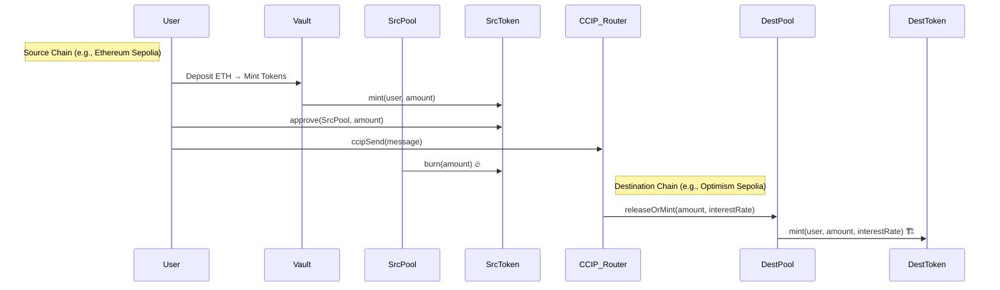

```mermaid
sequenceDiagram
    participant User
    participant Vault
    participant SrcPool
    participant SrcToken
    participant CCIP_Router
    participant DestPool
    participant DestToken

    Note left of User: Source Chain (e.g., Ethereum Sepolia)
    User->>Vault: Deposit ETH → Mint Tokens
    Vault->>SrcToken: mint(user, amount)
    User->>SrcToken: approve(SrcPool, amount)
    User->>CCIP_Router: ccipSend(message)
    SrcPool->>SrcToken: burn(amount) 🔥

    Note right of CCIP_Router: Destination Chain (e.g., Optimism Sepolia)
    CCIP_Router->>DestPool: releaseOrMint(amount, interestRate)
    DestPool->>DestToken: mint(user, amount, interestRate) 🏗️
```
